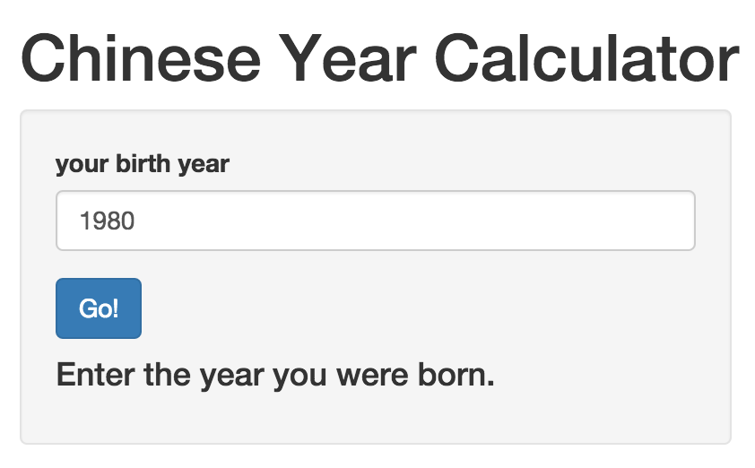

## Chinese Zodiac

Zodiac derives from the similar concept in western astrology and means "circle of animals". 
It is a scheme devised to help illiterate people use the Chinese ordinal system and estimate a person's age. 
Over the centuries, it has evolved into a systematic superstitious plan of future action that relates each year to an animal and its reputed attributes according to a 12-year mathematical cycle.
It remains popular in several East Asian countries including China, Vietnam, Korea, Japan, and Thailand.

From [Wikipedia](http://en.wikipedia.org/wiki/Chinese_zodiac)

---

## The 12 animal signs

1. Rat
2. Ox
3. Tiger
4. Rabbit
5. Dragon
6. Snake
7. Horse
8. Goat
9. Monkey
10. Rooster
11. Dog
12. Pig

---

## How to calculate using this app

Simply enter your year of birth, and you will know the corresponding animal of the year!

[Go to the calculator!](https://shenjunfei.shinyapps.io/project/)

---
## Note

This is not the exact method of calculating the Chinese year of animal, because strict definition of Chinese year is based on Chinese lunar calendar, where a New Year starts some time in January or February in the prevalent solar calendar, varying from year to year.
If you were born in Jan or Feb, this calculation may be incorrect. However, if you were not born in these two months, the calculator has the correct year of animal for you!

## Thanks!